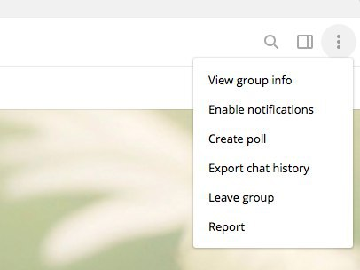

# Splunk Telegram

This app lets you run Splunk against messages from Telegram groups and generate
graphs based on the activity in them.

Splunk Telegram includes a Natural Language Processing (NLP) module which lets
you extract things like sentiment, Named Entities, etc.

This app is based on my other app, <a href="https://github.com/dmuth/splunk-lab/">Splunk Lab</a>,
which is a generate Splunk platform build for ingesting data on an ad-hoc basis.
You should check it out!

## Requirements

- Docker
- HTML exports from a Telegram conversation, channel, or group.
   - Exporting is explained further below

## Usage

- First step is to convert Telegram's HTML into JSON that Splunk can understand:
   - `bash <(curl -s https://raw.githubusercontent.com/dmuth/splunk-telegram/master/1-telegram-html-to-json.sh` path/to/telegram-export/messages\*.html > logs/Group-Name.json`
- Then, run Splunk:
   - `SPLUNK_START_ARGS=--accept-license bash <(curl -s https://raw.githubusercontent.com/dmuth/splunk-telegram/master/2-start-splunk.sh)`
   - You'll be presented with a list of options to confirm, change your environment variables if you like and re-run, otherwise press ENTER to launch Splunk.

By default, Splunk will be listening <a href="https://localhost:8000/">https://localhost:8000/</a>.

## Screenshots

## Exporting Data From Telegram

Telegram has a blog post which explains how to export data <a href="https://telegram.org/blog/export-and-more">over here</a>.
However, if you follow those instructions, **everything** will be exported, a process which will take hours and hours.
Instead, we recommend that you export a single channel, group, or conversation at a time.  
This can be done in the <a href="https://desktop.telegram.org/">Telegram Desktop App</a>
by going into the converstaion or group and manually exporting it:

This will save the converstaion in Telegram's own HTML format, which we can then
parse to extract messages.

## Licensing

Splunk has its own license.  Please abide by it.

The Docker image ships with the <a href="https://splunkbase.splunk.com/app/4066/">NLP Text Analytics app</a>, which is licensed under <a href="https://github.com/geekusa/nlp-text-analytics/blob/master/LICENSE/LICENSE.txt">the MIT License</a>.

## TODO/Bugs

Only regular messages are supported at this time.  If a photo is found, a note will
be made that it was a photo of a specified size.  No other media types (including stickers)
are supported at this time.

## Contact

My email is doug.muth@gmail.com.  I am also <a href="http://twitter.com/dmuth">@dmuth on Twitter</a> 
and <a href="http://facebook.com/dmuth">Facebook</a>!

